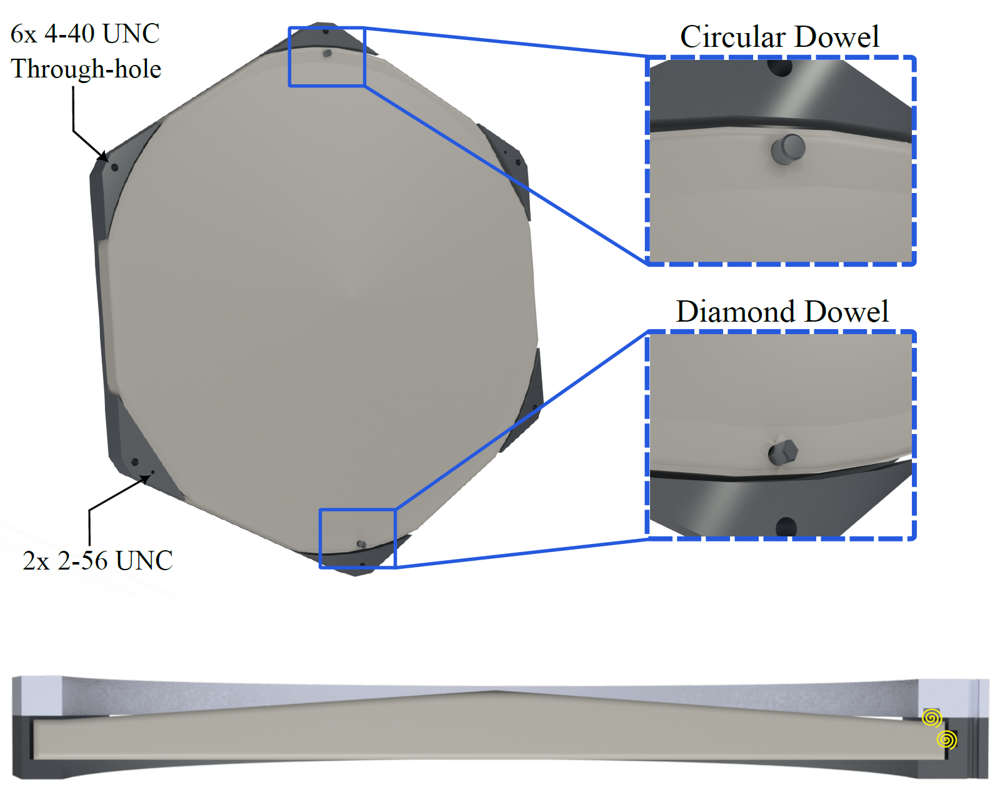

# SPT-4-Optics-Tube-Design

## Problem Statement:
Lenses are made from silicon, which is brittle at cryogenic temperatures and does not contract. The aluminum mount that fixes the lenses will contract and could crack the lenses without adding compliance to the interface between the aluminum and silicon.

## Design Constraints:
- lens placement tolerance: +/- 1 millimeter
- angular alignment tolerance: +/-
- center-center distance between lenses: 235 millimeters

## Overview of Optics Tubes:
The optics tubes contain the lens stack that accepts the light from the South Pole Telescope mirror assembly and reimages it onto the focal plane to capture images of the sky. Additional sets of baffling and infrared filters reject stray light from the environment that adds noise to the resultant image. The focal plane is suspended from the back of each optics tube with a network of Titanium (Ti 15-3-3-3; [analysis here](https://github.com/ahryciuk/Modal-Analysis-of-SPT-4-Cryostat-Support-Structures)) struts with an aperture defined by the lyot stop. 

A rendering of one of the seven optics tubes is annotated below.

  

## Retaining Ring Solution:
I took some inspiration from atomic and molecular optics to design a modular retaining ring that provides precision alignment, compliance to absorb differential thermal contraction of aluminum, and shipping protection. Each retaining ring mounts to the optics tube in any of the three location through the six 4-40 thru holes. Two 2-56 UNC bolts fix the two halves of the retaining ring around the lens. 

Precision alignment is two-fold. First, the hexagonally-cut lenses are keyed with one flat cut out of the six curved vertices for coarse alignment. This flat aligns with a corresponding flat in the retaining ring. Finer precision is achieved through a pair of dowel pins press-fit into each retaining ring (zoomed-in cutouts). Dowel pins offer much better precision than bolts, precision made more robust to machining tolerances by use of one diamond-shaped dowel pin.

Compliance is added by fitting Spira helical coils into cut grooves in the retaining ring (yellow spirals below). These protect the brittle silicon from cracking upon cooldown. Spiras are typically used at port interfaces for radio-frequency shielding (https://www.spira-emi.com/product/spira-shield/), but offer highly predictable torsional spring forces that are tuned by their diameter and thickness of wire. I use these torsional springs to add compliance without sacrificing constraining force. There are springs for both axial and radial contraction situated in grooves that allow 30% compression at room temperature, which equates to about 10 Newtons of constraining force.

  

## Files:
- CAD renders: /final_CAD_renders/
